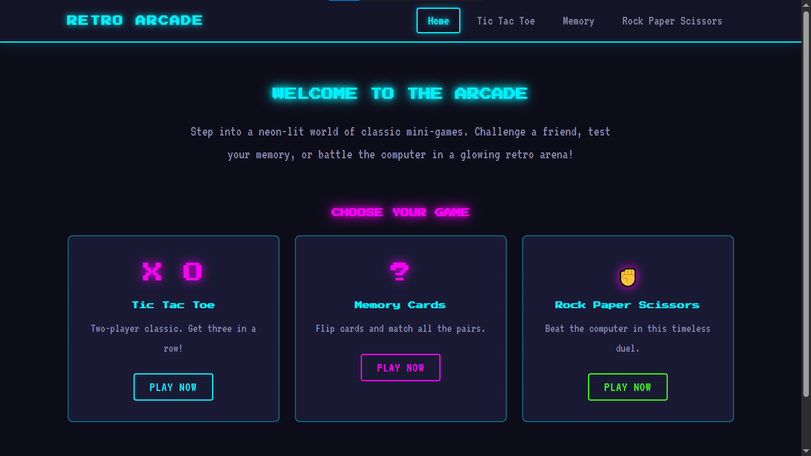
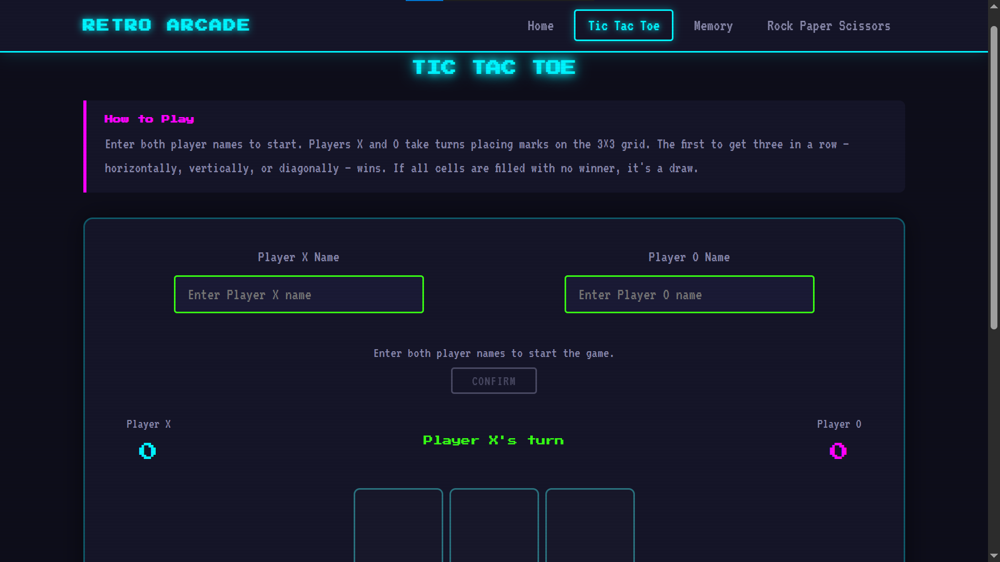
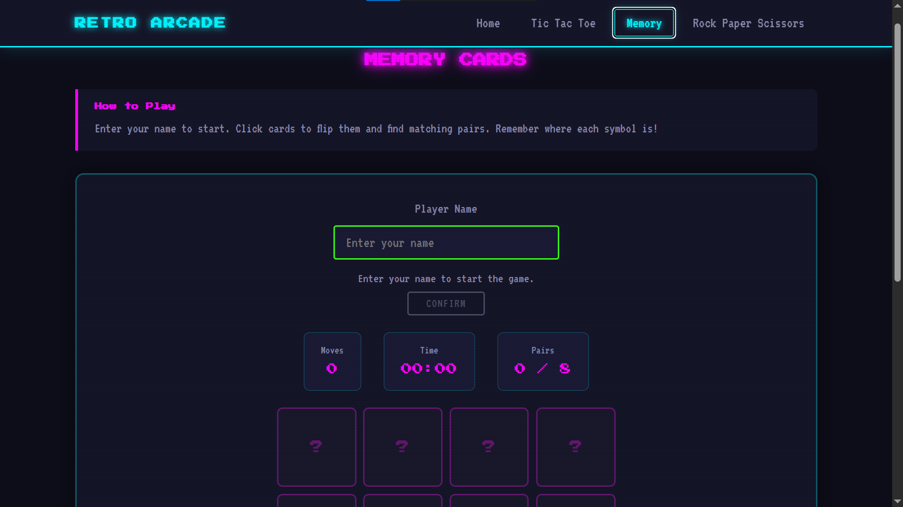
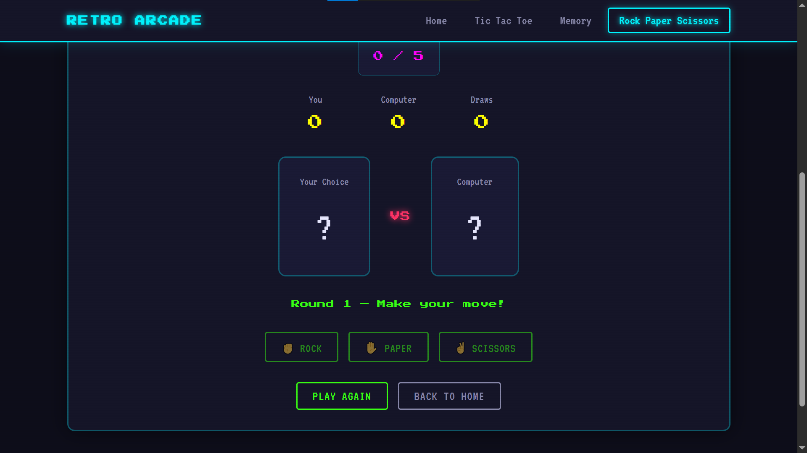

# 🎮 Retro Arcade Website

A neon-styled mini arcade built with HTML, CSS, and JavaScript. The project brings together three classic browser games—**Tic Tac Toe**, **Memory Cards**, and **Rock Paper Scissors**—inside one responsive retro interface.

The focus of this project is simple gameplay, clean UI interactions, and a nostalgic arcade feel without using any external game framework.

---

## 🌐 Live Demo

**Play Here:**  
https://rimi-hash.github.io/retro-arcade/

---

## 🎮 Games Included

### Tic Tac Toe
- Two-player mode
- Player name input
- Score tracking
- Winning line highlight
- Play Again option

### Memory Cards
- 8 matching pairs
- Move counter
- Timer
- Win message
- Play Again option

### Rock Paper Scissors
- Player vs Computer
- 5-round match
- Score tracking
- Final winner announcement

---

## ✨ Features

- Retro arcade-inspired UI
- Neon glowing effects
- Responsive design
- Smooth navigation
- Pure HTML, CSS & JavaScript
- No backend required
- No frameworks

---

# 📸 Screenshots

## 🏠 Home Page



---

## ❌⭕ Tic Tac Toe



---

## 🧠 Memory Cards



---

## ✊✋✌ Rock Paper Scissors



---

## 💻 Tech Stack

- HTML5
- CSS3
- JavaScript
- Google Fonts

---

## 📂 Project Structure

```text
retro-arcade/
│
├── index.html
├── style.css
├── script.js
├── README.md
└── screenshots/
    ├── home.png
    ├── tic-tac-toe.png
    ├── memory-cards.png
    └── rock-paper-scissors.png
```

---

## 🚀 How to Run

1. Clone or download the repository.
2. Open the project folder.
3. Open `index.html` in your browser.

No installation is required.

---

## 📚 What I Learned

- DOM Manipulation
- JavaScript Game Logic
- Event Handling
- Responsive Design
- Browser Storage Concepts
- UI/UX Design

---

## 🔮 Future Improvements

- Sound effects
- Online leaderboard
- More mini games
- Dark/Light themes
- Difficulty levels
- Better animations

---

## 👨‍💻 Author

**Rimi**
